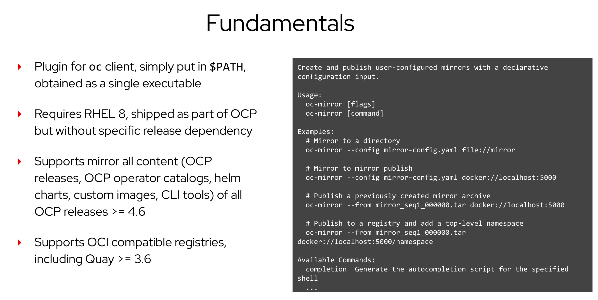
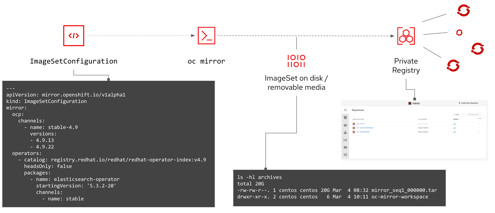
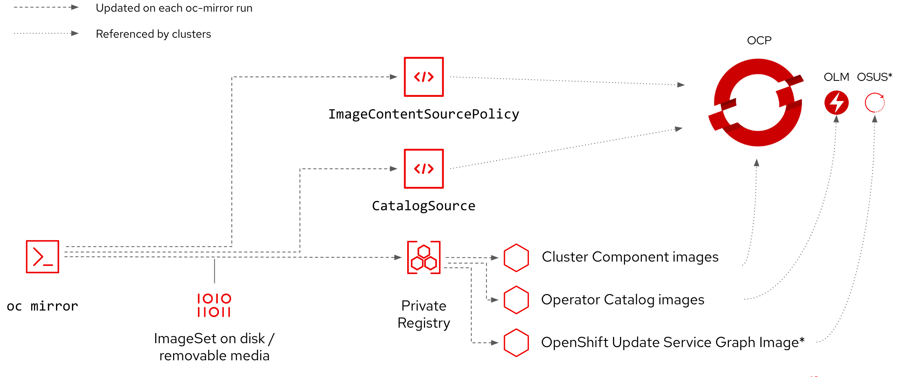

# OCP4 disconnected with Assisted Installer on premise

In this post we describe how to deploy OCP4 on **IaaS/bare metal**  in partially disconnected mode using the AI service on premise. Workers and Masters will boot from an ISO built so that a local Quay registry is used to retrieve the required images for deployment.

- Requirements:
  
  - Bastion machine with internet access, accessible from the nodes with 2TB storage capacity that will run **Assisted Service** and act as:
    - Local Quay registry
    - DNS server
    - NTP server
  - **IaaS** with boot from ISO support (eg: Vsphere, OpenStack, Nutanix)

  **⚠**  We assume readers are already familiar with **assisted installer** and/or have read this post:  <https://github.com/latouchek/assisted-installer-deepdive>.

  

## Part I : Build the Private Registry

- ### Install mirror registry

  **Mirror Registry** allows user to easily install Quay and its required components using a simple CLI tool. It is the perfect tool to demonstrate disconnected OCP installation but is not to be used in production.
  
  See bellow how to install and quickly configure it:

    ```bash
    BASTIONFQDN=$(hostname -f)
    wget https://developers.redhat.com/content-gateway/file/pub/openshift-v4/clients/mirror-registry/1.0/mirror-registry.tar.gz -O /opt/mirror-registry/mirror-registry.tar.gz
    cd  /opt/mirror-registry
    tar zxvf mirror-registry.tar.gz
    quayRoot='/mirror-ocp/quay'

    ./mirror-registry install --initPassword=<your password> --targetHostname $BASTIONFQDN  --quayRoot $quayRoot
    ```

- ### Create pull secret files for local registry and combine with the OCP pull secret

  So we can connect to both our local registry and Red Hat public Quay and pull the images, we generate a combined pull secret file and store it where Podman expects it.

    ```bash
    LOCAL_REGISTRY="$BASTIONFQDN:8443"
    podman login --authfile privaterepo.json \
    -u init \
    -p <your password> \
    ${LOCAL_REGISTRY} \
    --tls-verify=false 

    jq -cM -s '{"auths": ( .[0].auths + .[1].auths ) }' privaterepo.json pull-secret.json > compiled-pull-secret.json
    ```

- ### Copy the new pull secret to the default location

    ```bash
    mkdir -p $XDG_RUNTIME_DIR/containers/
    cp compiled-pull-secret.json $XDG_RUNTIME_DIR/containers/auth.json
    ```

- ### Copy self signed Quay certificate and upgrade trust store

    During quay installation, a self signed certificate is created. In order to avoid certificate errors when connecting to the private registry, it must be added to the Bastion Trust Store.

    ```bash

    cp $quayRoot/quay-rootCA/rootCA.pem /etc/pki/ca-trust/source/anchors/

    update-ca-trust extract

    ```

- ### Copy self signed Quay certificate

    We'll need the certificate for later

    ```bash
    cp $quayRoot/quay-rootCA/rootCA.pem Certs/rootCA.pem
    ```

- ### Mirror OCP 4.10 image to private registry

  This command downloads and pushes the images needed for OCP 4.10 installation to the private registry.

    ```bash
    LOCAL_SECRET_JSON='compiled-pull-secret.json'
    LOCAL_REGISTRY="$BASTIONFQDN:8443"
    RELEASE_NAME="ocp-release"
    ARCHITECTURE="x86_64"
    OCP_RELEASE="4.10.14"
    LOCAL_REPOSITORY="ocp4/openshift4"
    PRODUCT_REPO="openshift-release-dev"

    oc adm release mirror -a ${LOCAL_SECRET_JSON}  \
        --from=quay.io/${PRODUCT_REPO}/${RELEASE_NAME}:${OCP_RELEASE}-${ARCHITECTURE} \
        --to=${LOCAL_REGISTRY}/${LOCAL_REPOSITORY} \
        --to-release-image=${LOCAL_REGISTRY}/${LOCAL_REPOSITORY}:${OCP_RELEASE}-${ARCHITECTURE} --insecure=true
    ```

  **⚠**  If you get an error, make sure you create a set of ssh keys named **quay_installer**

- ### Mirror operators to local registry

  This operation requires a lot of time and at least 2To of storage on the bastion machine. It's only optional for now and can be skipped if you only want to try images mirroring.

  ```bash
  oc adm catalog mirror registry.redhat.io/redhat/redhat-operator-index:v4.10 $LOCAL_REGISTRY/ocp-operator --index-filter-by-os='linux/amd64'
  ```

## Part II: Configure Assisted Installer for disconnected deployment

In this scenario the service and associated components are deployed onto the Bastion host in containers using Podman.

- Get the bits

  ```bash
  git clone https://github.com/openshift/assisted-service.git
  cp -r assisted-service/deploy/podman /opt/podman-ai-onprem
  cd /opt/podman-ai-onprem
  ```

- Modify Pod configuration
  
  **AI** service environment variables are defined in **configmap.yml** and **pod.yml**. Both need to be amended to insure we use the private registry previously created and that the private registry root CA is in the assisted-service Trust Store.

  - In **configmap.yml** modify **PUBLIC_CONTAINER_REGISTRIES** and **RELEASE_IMAGES** values as shown bellow. Basically we instruct **AI** to pull images from our local registry. **(See example in podman folder)**

    ```bash
    LOCAL_REGISTRY="$BASTIONFQDN:8443"
    RELEASE_NAME="ocp-release"
    ARCHITECTURE="x86_64"
    OCP_RELEASE="4.10.14"
    LOCAL_REPOSITORY="ocp4/openshift4"
    BASTIONIP='10.145.145.97'

    PUBLIC_CONTAINER_REGISTRIES: 'quay.io,${LOCAL_REGISTRY}'
    RELEASE_IMAGES: '[{"openshift_version":"4.10","cpu_architecture":"x86_64","url":"${LOCAL_REGISTRY}/${ocp4/openshift4}:${OCP_RELEASE}-${ARCHITECTURE}","version":"${OCP_RELEASE}","default":true}]'
    SERVICE_BASE_URL: http://$BASTIONIP:8090

  - The assisted service pod needs access to the host Trust Store where we added Quay Root certificate. One way to achieve that is to  add a **volumeMounts** in the pod definition file pointing to the host Trust Store **(See example in podman folder)**.

    ```yaml
        volumeMounts:
        - mountPath: /etc/pki/ca-trust/extracted/pem
            name: registry-ca
        restartPolicy: Never
        volumes:
        - hostPath:
            path: /etc/pki/ca-trust/extracted/pem
            type: Directory
            name: registry-ca
    ```

- Start the assisted service

   ```bash
   podman play kube --configmap configmap-disconnected.yml pod-ca.yml
   ```

  After a while  the GUI should be accessible at <https://BASTIONIP:8080>.
  We are now ready to use AI and deploy an OCP cluster in disconnected mode.

## Part III: Create a disconnected OCP 4 cluster

- Prepare the cluster configuration file

  **⚠** All commands must be issued from the **ai-files** directory and network infos modified to fit your environment
  
  By specifying **private-repo.json** as **pull_secret** parameter, we instruct AI to use the local registry.
  
  ```bash
    export AI_URL='http://$BASTIONIP:8090'

    jq -n  --arg PULLSECRET "$(cat privaterepo.json)" --arg SSH_KEY "$(cat ~/.ssh/id_ed25519.pub)" '{
        "kind": "Cluster",
        "name": "ocpd",
        "openshift_version": "4.10",
        "base_dns_domain": "lab.local",
        "hyperthreading": "all",
        "api_vip": "10.145.145.107",
        "ingress_vip": "10.145.145.108",
        "schedulable_masters": false,
        "platform": {
          "type": "baremetal"
        },
        "user_managed_networking": false,
        "cluster_networks": [
          {
            "cidr": "172.20.0.0/16",
            "host_prefix": 23
          }
        ],
        "service_networks": [
          {
            "cidr": "172.31.0.0/16"
          }
        ],
        "machine_networks": [
          {
            "cidr": "10.145.145.96/27"
          }
        ],
        "network_type": "OVNKubernetes",
        "additional_ntp_source": "ntp1.hetzner.de",
        "vip_dhcp_allocation": false,
        "high_availability_mode": "Full",
        "hosts": [], 
        "ssh_public_key": $SSH_KEY,
        "pull_secret": $PULLSECRET
    }' > deployment-disconnected.json
    ```

- Create the cluster and retrieve its UUID

    ```bash
    curl -s -X POST "$AI_URL/api/assisted-install/v2/clusters" \
      -d @./deployment-disconnected.json \
      --header "Content-Type: application/json" \
      | jq .

    export CLUSTER_ID=$(curl -s -X GET "$AI_URL/api/assisted-install/v2/clusters?with_hosts=true" -H "accept: application/json" -H "get_unregistered_clusters: false"| jq -r '.[].id')
    echo $CLUSTER_ID
    rm -f deployment-disconnected.json

  ```

  This command should output the cluster UUID and the UI should show the newly created cluster

- Add Trust CA and local repo to install-config.yaml
  
  Assisted Installer allows us to modify install-config.yaml by patching the cluster definition.
  
  First create the following file:

    ```bash
    cat << EOF > repo-ca.yaml
    additionalTrustBundle: |
      -----BEGIN CERTIFICATE-----

          yourcertificate
      -----END CERTIFICATE-----
    imageContentSources:
      - mirrors:
        - ${LOCAL_REGISTRY}/${LOCAL_REPOSITORY}
        source: quay.io/openshift-release-dev/ocp-release
      - mirrors:
        - ${LOCAL_REGISTRY}/${LOCAL_REPOSITORY}
        source: quay.io/openshift-release-dev/ocp-v4.0-art-dev
    EOF
    ```
  
- Convert repo-ca.yaml to json and patch the cluster

   ```bash
   yq -cR . repo-ca.yaml > repo-ca.json
   curl -X 'PATCH' \
      "$AI_URL/api/assisted-install/v2/clusters/$CLUSTER_ID/install-config" \
      -H 'accept: application/json' \
      -H 'Content-Type: application/json' \
      -d @./repo-ca.json
   ```

   You should see no output. To see the amended install-config.yaml, use the following command:

   ```bash
   curl -X 'GET'   "$AI_URL/api/assisted-install/v2/clusters/$CLUSTER_ID/install-config"   -H 'accept: application/json'   -H 'Content-Type: application/json'|jq -r .
   ```

- Create and patch ISO with registry and certificate infos
  
  With AI, nodes are being booted with the ISO that contains the logic needed to configure them to the desired state.
  To prepare the ISO, we are going to create an **infra-env** object through AI API.
  In this example in addition to setting up certificate and registry configuration, we also are going to assign static IPs to the nodes and set up a bond.
  See the following blog post for more details (<https://github.com/latouchek/assisted-installer-deepdive/tree/main#part-iv--network-tweaks>) as well as the examples in the nmstate-config folder.

  **⚠** The interfaces names and mac addresses must be modified according to your infrastructure specs

  - Prepare Infra configuration JSON file

    ```bash
    export NIC_CONFIG='bond-static'
    jq -n --arg CLUSTERID "$CLUSTER_ID" --arg PULLSECRET "$(cat pull-secret-privaterepo.json)" \
        --arg SSH_KEY "$(cat ~/.ssh/id_ed25519.pub)" \
        --arg NMSTATEM_YAML0 "$(cat ./nmstate-config/$NIC_CONFIG/nmstate-$NIC_CONFIG-master0.yaml)" --arg NMSTATEM_YAML1 "$(cat ./nmstate-config/$NIC_CONFIG/nmstate-$NIC_CONFIG-master1.yaml)" --arg NMSTATEM_YAML2 "$(cat ./nmstate-config/$NIC_CONFIG/nmstate-$NIC_CONFIG-master2.yaml)" \
        --arg NMSTATE_YAML0 "$(cat ./nmstate-config/$NIC_CONFIG/nmstate-$NIC_CONFIG-worker0.yaml)" --arg NMSTATE_YAML1 "$(cat ./nmstate-config/$NIC_CONFIG/nmstate-$NIC_CONFIG-worker1.yaml)" --arg NMSTATE_YAML2 "$(cat ./nmstate-config/$NIC_CONFIG/nmstate-$NIC_CONFIG-worker2.yaml)" '{
    "name": "ocpd_infra-env",
    "openshift_version": "4.10",
    "pull_secret": $PULLSECRET,
    "ssh_authorized_key": $SSH_KEY,
    "image_type": "full-iso",
    "cluster_id": $CLUSTERID,
    "static_network_config": [
      {
        "network_yaml": $NMSTATEM_YAML0,
        "mac_interface_map": [{"mac_address": "aa:bb:cc:11:42:10", "logical_nic_name": "ens3"}, {"mac_address": "aa:bb:cc:11:42:c0", "logical_nic_name": "ens4"}]
      },
      {
        "network_yaml": $NMSTATEM_YAML1,
        "mac_interface_map": [{"mac_address": "aa:bb:cc:11:42:11", "logical_nic_name": "ens3"}, {"mac_address": "aa:bb:cc:11:42:c1", "logical_nic_name": "ens4"}]
      },
      {
        "network_yaml": $NMSTATEM_YAML2,
        "mac_interface_map": [{"mac_address": "aa:bb:cc:11:42:12", "logical_nic_name": "ens3"}, {"mac_address": "aa:bb:cc:11:42:c2", "logical_nic_name": "ens4"}]
      },
      {
        "network_yaml": $NMSTATE_YAML0,
        "mac_interface_map": [{"mac_address": "aa:bb:cc:11:42:20", "logical_nic_name": "ens3"}, {"mac_address": "aa:bb:cc:11:42:50", "logical_nic_name": "ens4"},{"mac_address": "aa:bb:cc:11:42:60", "logical_nic_name": "ens5"}]
      },
      {
        "network_yaml": $NMSTATE_YAML1,
        "mac_interface_map": [{"mac_address": "aa:bb:cc:11:42:21", "logical_nic_name": "ens3"}, {"mac_address": "aa:bb:cc:11:42:51", "logical_nic_name": "ens4"},{"mac_address": "aa:bb:cc:11:42:61", "logical_nic_name": "ens5"}]
      },
      {
        "network_yaml": $NMSTATE_YAML2,
        "mac_interface_map": [{"mac_address": "aa:bb:cc:11:42:22", "logical_nic_name": "ens3"}, {"mac_address": "aa:bb:cc:11:42:52", "logical_nic_name": "ens4"},{"mac_address": "aa:bb:cc:11:42:62", "logical_nic_name": "ens5"}]
      }
    ]
    }' > nmstate-$NIC_CONFIG
    ```

  - Create the **infra-env** and get its UUID

    ```bash
    curl -H "Content-Type: application/json" -X POST -d @nmstate-$NIC_CONFIG ${AI_URL}/api/assisted-install/v2/infra-envs | jq .

    export INFRAENV_ID=$(curl -X GET "$AI_URL/api/assisted-install/v2/infra-envs" -H "accept: application/json" | jq -r '.[].id' | awk 'NR<2')
    echo $INFRAENV_ID
    rm -rf nmstate-$NIC_CONFIG
    ```

  - Patch the infra-env

    The infra-env just created contains the network and cluster details. For the nodes to use the local registry, we want to modify **/etc/containers/registries.conf** and copy the content of Certs/rootCA.pem to **/etc/pki/ca-trust/source/anchors/registry.crt**. That is done by using **ignition_config_override** parameter when patching the **infra-env**.

    - Method 1

       Create **registries.conf**

       ```bash
       cat << EOF > registries.conf
       unqualified-search-registries = ["registry.access.redhat.com", "docker.io"]
       short-name-mode = ""

       [[registry]]
          prefix = ""
          location = "${LOCAL_REGISTRY}"
          insecure = true
      EOF
       ```

       Patch the **infra-env** with the following command:

       ```bash
       jq -n --arg OVERRIDE "{\"ignition\": {\"version\": \"3.1.0\"}, \"storage\": {\"files\": [{\"path\": \"/etc/pki/ca-trust/source/anchors/registry.crt\", \"mode\": 420, \"overwrite\": true, \"user\": {\"name\": \"root\"}, \"contents\": {\"source\": \"data:text/plain;base64,$(cat Certs/rootCA.pem | base64 -w 0)\"}}, {\"path\": \"/etc/containers/registries.conf\", \"mode\": 420, \"overwrite\": true, \"user\": {\"name\": \"root\"}, \"contents\": {\"source\": \"data:text/plain;base64,$(cat registries.conf | base64 -w 0)\"}}]}}" \
      '{
        "ignition_config_override": $OVERRIDE
      }' > ignition-registry

      curl \
          --header "Content-Type: application/json" \
          --request PATCH \
          --data  @ignition-registry \
          "$AI_URL/api/assisted-install/v2/infra-envs/$INFRAENV_ID"      
      ```

      That ensures that when the nodes are being provisioned, the required files will be written with the specified rights and at the proper location

    - Method 2

      For better visibility we can also create the content of **ignition_config_override** as follow:

      ```bash
      OVERRIDE=$(jq -ncR --arg ROOTCA64 "$(cat Certs/rootCA.pem | base64 -w 0)" --arg REG64 "$(cat registries.conf | base64 -w 0)" \
      '{
        "ignition": {
            "version": "3.1.0"
        },
        "storage": {
            "files": [
              {
                  "path": "/etc/pki/ca-trust/source/anchors/registry.crt",
                  "mode": 420,
                  "overwrite": true,
                  "user": {
                    "name": "root"
                  },
                  "contents": {
                    "source": "data:text/plain;base64,\($ROOTCA64)"
                  }
              },
              {
                  "path": "/etc/containers/registries.conf",
                  "mode": 420,
                  "overwrite": true,
                  "user": {
                    "name": "root"
                  },
                  "contents": {
                    "source": "data:text/plain;base64,\($REG64)"
                  }
              }
            ]
        }
      }') 
      ```

      Write the content to a JSON file

      ```bash
      jq -n --arg OVERRIDE "$OVERRIDE" \
      '{
        "ignition_config_override": $OVERRIDE
      }' > rootca-registries.json
      ```

      Patch the infra

      ```bash
      curl \
          --header "Content-Type: application/json" \
          --request PATCH \
          --data  @rootca-registries.json \
          "$AI_URL/api/assisted-install/v2/infra-envs/$INFRAENV_ID"
      ```

      Get patched infra specs

      ```bash
      curl --header "Content-Type: application/json" \
      --request GET "$AI_URL/api/assisted-install/v2/infra-envs/$INFRAENV_ID"|jq -r .
      ```

- Download the ISO

  ```bash
  ISO_URL=$(curl -X GET "$AI_URL/api/assisted-install/v2/infra-envs/$INFRAENV_ID/downloads/image-url" -H "accept: application/json"|jq -r .url)
  rm -rf /opt/discovery_image_ocpd.iso
  curl -X GET "$ISO_URL" -H "accept: application/octet-stream" -o /opt/images/discovery_image_ocpd.iso
  ```

- Create and boot the nodes from created ISO

  It's now time to create our nodes and boot them from the ISO we just created. Depending on the IaaS platform, the process might differ (Examples of automation of this process with **terraform** can be found in the **terraform** folder).

- Watch the nodes being discovered on the GUI and trigger the deployment
- Kick off the deployment and wait for it to complete

  ```bash
  sleep 120 ###Time needed for the nodes to boot and being in ready state

  ####Start Deployment###
  curl -X POST \
    "$AI_URL/api/assisted-install/v2/clusters/$CLUSTER_ID/actions/install" \
    -H "accept: application/json" \
    -H "Content-Type: application/json"

  ```

  **⚠**  Monitor assisted service by watching the pod logs:

  ```bash
  podman logs -f assisted-installer-service
  ```
## Part IV : using operators catalog (under construction)
- Install oc-mirror cli
```bash 
wget https://mirror.openshift.com/pub/openshift-v4/amd64/clients/ocp-dev-preview/pre-release/oc-mirror.tar.gz
tar -xvf oc-mirror.tar.gz
chmod +x oc-mirror
sudo mv oc-mirror /usr/local/bin/.
```
**oc-mirror** the single tool for all your OpenShift content mirroring needs. Creates initial mirror and keeps it updated. This cli tool offers same experience as connected customers.


- Download your [registry.redhat.io](registry.redhat.io) [pull secret from the Red Hat OpenShift Cluster Manager](https://console.redhat.com/openshift/install/pull-secret) and save it to a .json file and place at ~/.docker/config.json. This config.json file is needed to access Red Hat repositories to download container images or to create tarball.

To have more information regarding oc-mirror cli you can have a look [here](https://github.com/openshift/oc-mirror). **oc-mirror** is a powerful cli tool for [Content Discovery](https://github.com/openshift/oc-mirror#content-discovery) or [Mirroring](https://github.com/openshift/oc-mirror#mirroring)

###  First usecase:  
#### we want to install RHACM in disconnected mode 
- the most important file is the imageset-config.yaml (ImageSetConfiguration) definition. 
```bash
apiVersion: mirror.openshift.io/v1alpha2
kind: ImageSetConfiguration
mirror:
 ocp:
   channels:
     - name: stable-4.10
 operators:
   - catalog: registry.redhat.io/redhat/redhat-operator-index:v4.10
     headsOnly: false
     packages:
       - name: advanced-cluster-management
         startingVersion: '2.4.2'
         channels:
           - name: 'latest'
```


```bash
[root@bastion ~]# oc-mirror --config=./imageset-config.yaml file://openshift410
INFO Creating directory: openshift410/oc-mirror-workspace/src/publish
INFO Creating directory: openshift410/oc-mirror-workspace/src/v2
INFO Creating directory: openshift410/oc-mirror-workspace/src/charts
WARNING backend is not configured in ./imageset-config.yaml, using stateless mode
INFO No metadata detected, creating new workspace
```
by using this command we are creating a tarball into the directory *openshift410* and when it's done we can publish the content to the mirror registry using : 

```bash
oc-mirror --from /path/to/openshift410 docker://reg.mirror.com
```

to avoid the backend WARNING we can add a *StorageConfig* section into the **ImageSetConfiguration** definition like :
*locally on disk
```bash
apiVersion: mirror.openshift.io/v1alpha2
kind: ImageSetConfiguration
archiveSize: 1
storageConfig:
  local:
    path: /home/user/workspace
```
or directly to the repository
```bash
apiVersion: mirror.openshift.io/v1alpha2
kind: ImageSetConfiguration
storageConfig:
  registry:
    imageURL: localhost:5000/metadata:latest
    skipTLS: true
```

Explanation of the oc-mirror process : 
 

- To keep mirror up-to-date:  **TO BE TESTED - NOT DONE YET**
 1. Run oc-mirror again, with the same or updated config file
 2. Differential mirror
     - will only download newer OCP releases
     - will only download newer Operator versions
 3. Produces new catalog images in place for seamless operator updates

### Second usecase: 
#### we want to install all operators existing in our standard installation.
**⚠** Mirroring the official Red Hat OpenShift Operators catalog (containing Red Hat OpenShift Service Mesh, Pipelines, GitOps and others) will consume more than **350GB** for the whole catalog. 

OperatorHub: 3 catalogs, to use optional Operators / OpenShift Layered Products
Red Hat Operators (3100+ images, 220+ GB)
Certified Operators (1600+ images, 160+ GB)
Community Operators (2160+ images, 65+ GB)
- we have to generate the list of all operators to include them into the ImageSetConfiguration file 

- when all operators are defined into ImageSetconfiguration file we have to run oc-mirror to update our mirroring repository.


## Part V : Upgrade of the cluster (under construction)


### Thank you for reading

## References

- [Disconnected OpenShift Assisted Installer Service](https://kenmoini.com/post/2022/01/disconnected-openshift-assisted-installer-service/#assisted-installer-service-config)
- <https://github.com/openshift/assisted-service>
- [Mirror Registry](https://github.com/quay/mirror-registry) 
- [Introducing Mirror Registry for Red Hat OpenShift](https://cloud.redhat.com/blog/introducing-mirror-registry-for-red-hat-openshift)
