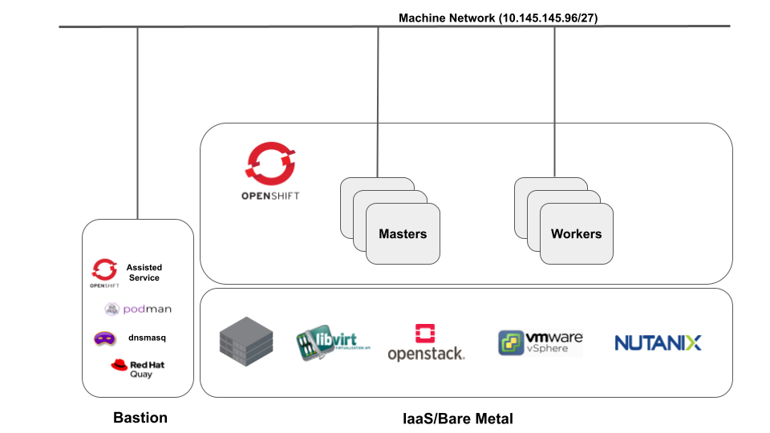

# OCP4 disconnected with Assisted Installer on premise

In this post we describe how to deploy OCP4 on **IaaS/bare metal**  in partially disconnected mode using the AI service on premise. Workers and Masters will boot from an ISO built so that a local Quay registry is used to retrieve the required images for deployment.

- Requirements:
  
  - Bastion machine with internet access, accessible from the nodes with 2TB storage capacity that will run **Assisted Service** and act as:
    - Local Quay registry
    - DNS server
    - NTP server
  - **IaaS** with boot from ISO support (eg: Vsphere, OpenStack, Nutanix)

  **⚠**  We assume readers are already familiar with **assisted installer** and/or have read this post:  <https://github.com/latouchek/assisted-installer-deepdive>.

  

## Part I : Build the Private Registry

- ### Install mirror registry

  **Mirror Registry** allows user to easily install Quay and its required components using a simple CLI tool. It is the perfect tool to demonstrate disconnected OCP installation but is not to be used in production.
  
  See bellow how to install and quickly configure it:

    ```bash
    BASTIONFQDN=$(hostname -f)
    wget https://developers.redhat.com/content-gateway/rest/mirror/pub/openshift-v4/clients/mirror-registry/latest/mirror-registry.tar.gz -O /opt/mirror-registry/mirror-registry.tar.gz
    cd  /opt/mirror-registry
    tar zxvf mirror-registry.tar.gz
    quayRoot='/mirror-ocp/quay'

    ./mirror-registry install --initPassword=<your password> --targetHostname $BASTIONFQDN  --quayRoot $quayRoot
    ```

- ### Create pull secret files for local registry and combine with the OCP pull secret

  So we can connect to both our local registry and Red Hat public Quay and pull the images, we generate a combined pull secret file and store it where Podman expects it.

    ```bash
    LOCAL_REGISTRY="$BASTIONFQDN:8443"
    podman login --authfile privaterepo.json \
    -u init \
    -p <your password> \
    ${LOCAL_REGISTRY} \
    --tls-verify=false 

    jq -cM -s '{"auths": ( .[0].auths + .[1].auths ) }' privaterepo.json pull-secret.json > compiled-pull-secret.json
    ```

- ### Copy the new pull secret to the default location

    ```bash
    mkdir -p $XDG_RUNTIME_DIR/containers/
    cp compiled-pull-secret.json $XDG_RUNTIME_DIR/containers/auth.json
    ```

- ### Copy self signed Quay certificate and upgrade trust store

    During quay installation, a self signed certificate is created. In order to avoid certificate errors when connecting to the private registry, it must be added to the Bastion Trust Store.

    ```bash

    cp $quayRoot/quay-rootCA/rootCA.pem /etc/pki/ca-trust/source/anchors/

    update-ca-trust extract

    ```

- ### Copy self signed Quay certificate

    We'll need the certificate for later

    ```bash
    cp $quayRoot/quay-rootCA/rootCA.pem Certs/rootCA.pem
    ```

- ### Mirror OCP 4.10 image to private registry

  This command downloads and pushes the images needed for OCP 4.10 installation to the private registry.

    ```bash
    LOCAL_SECRET_JSON='compiled-pull-secret.json'
    LOCAL_REGISTRY="$BASTIONFQDN:8443"
    RELEASE_NAME="ocp-release"
    ARCHITECTURE="x86_64"
    OCP_RELEASE="4.10.14"
    LOCAL_REPOSITORY="ocp4/openshift4"
    PRODUCT_REPO="openshift-release-dev"

    oc adm release mirror -a ${LOCAL_SECRET_JSON}  \
        --from=quay.io/${PRODUCT_REPO}/${RELEASE_NAME}:${OCP_RELEASE}-${ARCHITECTURE} \
        --to=${LOCAL_REGISTRY}/${LOCAL_REPOSITORY} \
        --to-release-image=${LOCAL_REGISTRY}/${LOCAL_REPOSITORY}:${OCP_RELEASE}-${ARCHITECTURE} --insecure=true
    ```

  **⚠**  If you get an error, make sure you create a set of ssh keys named **quay_installer**

- ### Mirror operators to local registry

  This operation requires a lot of time and at least 2To of storage on the bastion machine. It's only optional for now and can be skipped if you only want to try images mirroring.

  ```bash
  oc adm catalog mirror registry.redhat.io/redhat/redhat-operator-index:v4.10 $LOCAL_REGISTRY/ocp-operator --index-filter-by-os='linux/amd64'
  ```

## Part II: Configure Assisted Installer for disconnected deployment

In this scenario the service and associated components are deployed onto the Bastion host in containers using Podman.

- Get the bits

  ```bash
  git clone https://github.com/openshift/assisted-service.git
  cp -r assisted-service/deploy/podman /opt/podman-ai-onprem
  cd /opt/podman-ai-onprem
  ```

- Modify Pod configuration
  
  **AI** service environment variables are defined in **configmap.yml** and **pod.yml**. Both need to be amended to insure we use the private registry previously created and that the private registry root CA is in the assisted-service Trust Store.

  - In **configmap.yml** modify **PUBLIC_CONTAINER_REGISTRIES** and **RELEASE_IMAGES** values as shown bellow. Basically we instruct **AI** to pull images from our local registry. **(See example in podman folder)**

    ```bash
    LOCAL_REGISTRY="$BASTIONFQDN:8443"
    RELEASE_NAME="ocp-release"
    ARCHITECTURE="x86_64"
    OCP_RELEASE="4.10.14"
    LOCAL_REPOSITORY="ocp4/openshift4"
    BASTIONIP='10.145.145.97'

    PUBLIC_CONTAINER_REGISTRIES: 'quay.io,${LOCAL_REGISTRY}'
    RELEASE_IMAGES: '[{"openshift_version":"4.10","cpu_architecture":"x86_64","url":"${LOCAL_REGISTRY}/${ocp4/openshift4}:${OCP_RELEASE}-${ARCHITECTURE}","version":"${OCP_RELEASE}","default":true}]'
    SERVICE_BASE_URL: http://$BASTIONIP:8090

  - The assisted service pod needs access to the host Trust Store where we added Quay Root certificate. One way to achieve that is to  add a **volumeMounts** in the pod definition file pointing to the host Trust Store **(See example in podman folder)**.

    ```yaml
        volumeMounts:
        - mountPath: /etc/pki/ca-trust/extracted/pem
            name: registry-ca
        restartPolicy: Never
        volumes:
        - hostPath:
            path: /etc/pki/ca-trust/extracted/pem
            type: Directory
            name: registry-ca
    ```

- Start the assisted service

   ```bash
   podman play kube --configmap configmap-disconnected.yml pod-ca.yml
   ```

  After a while  the GUI should be accessible at <https://BASTIONIP:8080>.
  We are now ready to use AI and deploy an OCP cluster in disconnected mode.

## Part III: Create a disconnected OCP 4 cluster

- Prepare the cluster configuration file

  **⚠** All commands must be issued from the **ai-files** directory and network infos modified to fit your environment
  
  By specifying **private-repo.json** as **pull_secret** parameter, we instruct AI to use the local registry.
  
  ```bash
    export AI_URL='http://$BASTIONIP:8090'

    jq -n  --arg PULLSECRET "$(cat privaterepo.json)" --arg SSH_KEY "$(cat ~/.ssh/id_ed25519.pub)" '{
        "kind": "Cluster",
        "name": "ocpd",
        "openshift_version": "4.10",
        "base_dns_domain": "lab.local",
        "hyperthreading": "all",
        "api_vip": "10.145.145.107",
        "ingress_vip": "10.145.145.108",
        "schedulable_masters": false,
        "platform": {
          "type": "baremetal"
        },
        "user_managed_networking": false,
        "cluster_networks": [
          {
            "cidr": "172.20.0.0/16",
            "host_prefix": 23
          }
        ],
        "service_networks": [
          {
            "cidr": "172.31.0.0/16"
          }
        ],
        "machine_networks": [
          {
            "cidr": "10.145.145.96/27"
          }
        ],
        "network_type": "OVNKubernetes",
        "additional_ntp_source": "ntp1.hetzner.de",
        "vip_dhcp_allocation": false,
        "high_availability_mode": "Full",
        "hosts": [], 
        "ssh_public_key": $SSH_KEY,
        "pull_secret": $PULLSECRET
    }' > deployment-disconnected.json
    ```

- Create the cluster and retrieve its UUID

    ```bash
    curl -s -X POST "$AI_URL/api/assisted-install/v2/clusters" \
      -d @./deployment-disconnected.json \
      --header "Content-Type: application/json" \
      | jq .

    export CLUSTER_ID=$(curl -s -X GET "$AI_URL/api/assisted-install/v2/clusters?with_hosts=true" -H "accept: application/json" -H "get_unregistered_clusters: false"| jq -r '.[].id')
    echo $CLUSTER_ID
    rm -f deployment-disconnected.json

  ```

  This command should output the cluster UUID and the UI should show the newly created cluster

- Add Trust CA and local repo to install-config.yaml
  
  Assisted Installer allows us to modify install-config.yaml by patching the cluster definition.
  
  First create the following file:

    ```bash
    cat << EOF > repo-ca.yaml
    additionalTrustBundle: |
      -----BEGIN CERTIFICATE-----

          yourcertificate
      -----END CERTIFICATE-----
    imageContentSources:
      - mirrors:
        - ${LOCAL_REGISTRY}/${LOCAL_REPOSITORY}
        source: quay.io/openshift-release-dev/ocp-release
      - mirrors:
        - ${LOCAL_REGISTRY}/${LOCAL_REPOSITORY}
        source: quay.io/openshift-release-dev/ocp-v4.0-art-dev
    EOF
    ```
  
- Convert repo-ca.yaml to json and patch the cluster

   ```bash
   yq -cR . repo-ca.yaml > repo-ca.json
   curl -X 'PATCH' \
      "$AI_URL/api/assisted-install/v2/clusters/$CLUSTER_ID/install-config" \
      -H 'accept: application/json' \
      -H 'Content-Type: application/json' \
      -d @./repo-ca.json
   ```

   You should see no output. To see the amended install-config.yaml, use the following command:

   ```bash
   curl -X 'GET'   "$AI_URL/api/assisted-install/v2/clusters/$CLUSTER_ID/install-config"   -H 'accept: application/json'   -H 'Content-Type: application/json'|jq -r .
   ```

- Create and patch ISO with registry and certificate infos
  
  With AI, nodes are being booted with the ISO that contains the logic needed to configure them to the desired state.
  To prepare the ISO, we are going to create an **infra-env** object through AI API.
  In this example in addition to setting up certificate and registry configuration, we also are going to assign static IPs to the nodes and set up a bond.
  See the following blog post for more details (<https://github.com/latouchek/assisted-installer-deepdive/tree/main#part-iv--network-tweaks>) as well as the examples in the nmstate-config folder.

  **⚠** The interfaces names and mac addresses must be modified according to your infrastructure specs

  - Prepare Infra configuration JSON file

    ```bash
    export NIC_CONFIG='bond-static'
    jq -n --arg CLUSTERID "$CLUSTER_ID" --arg PULLSECRET "$(cat pull-secret-privaterepo.json)" \
        --arg SSH_KEY "$(cat ~/.ssh/id_ed25519.pub)" \
        --arg NMSTATEM_YAML0 "$(cat ./nmstate-config/$NIC_CONFIG/nmstate-$NIC_CONFIG-master0.yaml)" --arg NMSTATEM_YAML1 "$(cat ./nmstate-config/$NIC_CONFIG/nmstate-$NIC_CONFIG-master1.yaml)" --arg NMSTATEM_YAML2 "$(cat ./nmstate-config/$NIC_CONFIG/nmstate-$NIC_CONFIG-master2.yaml)" \
        --arg NMSTATE_YAML0 "$(cat ./nmstate-config/$NIC_CONFIG/nmstate-$NIC_CONFIG-worker0.yaml)" --arg NMSTATE_YAML1 "$(cat ./nmstate-config/$NIC_CONFIG/nmstate-$NIC_CONFIG-worker1.yaml)" --arg NMSTATE_YAML2 "$(cat ./nmstate-config/$NIC_CONFIG/nmstate-$NIC_CONFIG-worker2.yaml)" '{
    "name": "ocpd_infra-env",
    "openshift_version": "4.10",
    "pull_secret": $PULLSECRET,
    "ssh_authorized_key": $SSH_KEY,
    "image_type": "full-iso",
    "cluster_id": $CLUSTERID,
    "static_network_config": [
      {
        "network_yaml": $NMSTATEM_YAML0,
        "mac_interface_map": [{"mac_address": "aa:bb:cc:11:42:10", "logical_nic_name": "ens3"}, {"mac_address": "aa:bb:cc:11:42:c0", "logical_nic_name": "ens4"}]
      },
      {
        "network_yaml": $NMSTATEM_YAML1,
        "mac_interface_map": [{"mac_address": "aa:bb:cc:11:42:11", "logical_nic_name": "ens3"}, {"mac_address": "aa:bb:cc:11:42:c1", "logical_nic_name": "ens4"}]
      },
      {
        "network_yaml": $NMSTATEM_YAML2,
        "mac_interface_map": [{"mac_address": "aa:bb:cc:11:42:12", "logical_nic_name": "ens3"}, {"mac_address": "aa:bb:cc:11:42:c2", "logical_nic_name": "ens4"}]
      },
      {
        "network_yaml": $NMSTATE_YAML0,
        "mac_interface_map": [{"mac_address": "aa:bb:cc:11:42:20", "logical_nic_name": "ens3"}, {"mac_address": "aa:bb:cc:11:42:50", "logical_nic_name": "ens4"},{"mac_address": "aa:bb:cc:11:42:60", "logical_nic_name": "ens5"}]
      },
      {
        "network_yaml": $NMSTATE_YAML1,
        "mac_interface_map": [{"mac_address": "aa:bb:cc:11:42:21", "logical_nic_name": "ens3"}, {"mac_address": "aa:bb:cc:11:42:51", "logical_nic_name": "ens4"},{"mac_address": "aa:bb:cc:11:42:61", "logical_nic_name": "ens5"}]
      },
      {
        "network_yaml": $NMSTATE_YAML2,
        "mac_interface_map": [{"mac_address": "aa:bb:cc:11:42:22", "logical_nic_name": "ens3"}, {"mac_address": "aa:bb:cc:11:42:52", "logical_nic_name": "ens4"},{"mac_address": "aa:bb:cc:11:42:62", "logical_nic_name": "ens5"}]
      }
    ]
    }' > nmstate-$NIC_CONFIG
    ```

  - Create the **infra-env** and get its UUID

    ```bash
    curl -H "Content-Type: application/json" -X POST -d @nmstate-$NIC_CONFIG ${AI_URL}/api/assisted-install/v2/infra-envs | jq .

    export INFRAENV_ID=$(curl -X GET "$AI_URL/api/assisted-install/v2/infra-envs" -H "accept: application/json" | jq -r '.[].id' | awk 'NR<2')
    echo $INFRAENV_ID
    rm -rf nmstate-$NIC_CONFIG
    ```

  - Patch the infra-env

    The infra-env just created contains the network and cluster details. For the nodes to use the local registry, we want to modify **/etc/containers/registries.conf** and copy the content of Certs/rootCA.pem to **/etc/pki/ca-trust/source/anchors/registry.crt**. That is done by using **ignition_config_override** parameter when patching the **infra-env**.

    - Method 1

       Create **registries.conf**

       ```bash
       cat << EOF > registries.conf
       unqualified-search-registries = ["registry.access.redhat.com", "docker.io"]
       short-name-mode = ""

       [[registry]]
          prefix = ""
          location = "${LOCAL_REGISTRY}"
          insecure = true
      EOF
       ```

       Patch the **infra-env** with the following command:

       ```bash
       jq -n --arg OVERRIDE "{\"ignition\": {\"version\": \"3.1.0\"}, \"storage\": {\"files\": [{\"path\": \"/etc/pki/ca-trust/source/anchors/registry.crt\", \"mode\": 420, \"overwrite\": true, \"user\": {\"name\": \"root\"}, \"contents\": {\"source\": \"data:text/plain;base64,$(cat Certs/rootCA.pem | base64 -w 0)\"}}, {\"path\": \"/etc/containers/registries.conf\", \"mode\": 420, \"overwrite\": true, \"user\": {\"name\": \"root\"}, \"contents\": {\"source\": \"data:text/plain;base64,$(cat registries.conf | base64 -w 0)\"}}]}}" \
      '{
        "ignition_config_override": $OVERRIDE
      }' > ignition-registry

      curl \
          --header "Content-Type: application/json" \
          --request PATCH \
          --data  @ignition-registry \
          "$AI_URL/api/assisted-install/v2/infra-envs/$INFRAENV_ID"      
      ```

      That ensures that when the nodes are being provisioned, the required files will be written with the specified rights and at the proper location

    - Method 2

      For better visibility we can also create the content of **ignition_config_override** as follow:

      ```bash
      OVERRIDE=$(jq -ncR --arg ROOTCA64 "$(cat Certs/rootCA.pem | base64 -w 0)" --arg REG64 "$(cat registries.conf | base64 -w 0)" \
      '{
        "ignition": {
            "version": "3.1.0"
        },
        "storage": {
            "files": [
              {
                  "path": "/etc/pki/ca-trust/source/anchors/registry.crt",
                  "mode": 420,
                  "overwrite": true,
                  "user": {
                    "name": "root"
                  },
                  "contents": {
                    "source": "data:text/plain;base64,\($ROOTCA64)"
                  }
              },
              {
                  "path": "/etc/containers/registries.conf",
                  "mode": 420,
                  "overwrite": true,
                  "user": {
                    "name": "root"
                  },
                  "contents": {
                    "source": "data:text/plain;base64,\($REG64)"
                  }
              }
            ]
        }
      }') 
      ```

      Write the content to a JSON file

      ```bash
      jq -n --arg OVERRIDE "$OVERRIDE" \
      '{
        "ignition_config_override": $OVERRIDE
      }' > rootca-registries.json
      ```

      Patch the infra

      ```bash
      curl \
          --header "Content-Type: application/json" \
          --request PATCH \
          --data  @rootca-registries.json \
          "$AI_URL/api/assisted-install/v2/infra-envs/$INFRAENV_ID"
      ```

      Get patched infra specs

      ```bash
      curl --header "Content-Type: application/json" \
      --request GET "$AI_URL/api/assisted-install/v2/infra-envs/$INFRAENV_ID"|jq -r .
      ```

- Download the ISO

  ```bash
  ISO_URL=$(curl -X GET "$AI_URL/api/assisted-install/v2/infra-envs/$INFRAENV_ID/downloads/image-url" -H "accept: application/json"|jq -r .url)
  rm -rf /opt/discovery_image_ocpd.iso
  curl -X GET "$ISO_URL" -H "accept: application/octet-stream" -o /opt/images/discovery_image_ocpd.iso
  ```

- Create and boot the nodes from created ISO

  It's now time to create our nodes and boot them from the ISO we just created. Depending on the IaaS platform, the process might differ (Examples of automation of this process with **terraform** can be found in the **terraform** folder).

- Watch the nodes being discovered on the GUI and trigger the deployment
- Kick off the deployment and wait for it to complete

  ```bash
  sleep 120 ###Time needed for the nodes to boot and being in ready state

  ####Start Deployment###
  curl -X POST \
    "$AI_URL/api/assisted-install/v2/clusters/$CLUSTER_ID/actions/install" \
    -H "accept: application/json" \
    -H "Content-Type: application/json"

  ```

  **⚠**  Monitor assisted service by watching the pod logs:

  ```bash
  podman logs -f assisted-installer-service
  ```
## Part IV : using operators catalog 
- Install oc-mirror cli
```bash 
wget https://mirror.openshift.com/pub/openshift-v4/amd64/clients/ocp-dev-preview/pre-release/oc-mirror.tar.gz
tar -xvf oc-mirror.tar.gz
chmod +x oc-mirror
sudo mv oc-mirror /usr/local/bin/.
oc-mirror version
Client Version: version.Info{Major:"", Minor:"", GitVersion:"4.11.0-202205301910.p0.g4b43175.assembly.stream-4b43175", GitCommit:"4b43175880b66615935e6817c61d43f05ce91a0e", GitTreeState:"clean", BuildDate:"2022-05-30T21:14:55Z", GoVersion:"go1.18", Compiler:"gc", Platform:"linux/amd64"}
```
**oc-mirror** the single tool for all your OpenShift content mirroring needs. Creates initial mirror and keeps it updated. This cli tool offers same experience as connected customers.


- Download your [registry.redhat.io](registry.redhat.io) [pull secret from the Red Hat OpenShift Cluster Manager](https://console.redhat.com/openshift/install/pull-secret) and save it to a .json file and place at ~/.docker/config.json. This config.json file is needed to access Red Hat repositories to download container images or to create tarball.

To have more information regarding oc-mirror cli you can have a look [here](https://github.com/openshift/oc-mirror). **oc-mirror** is a powerful cli tool for [Content Discovery](https://github.com/openshift/oc-mirror#content-discovery) or [Mirroring](https://github.com/openshift/oc-mirror#mirroring)

###  First usecase:  
#### we want to install RHACM in disconnected mode 
- The most important file is the [imageset-config.yaml](./config/imageset-config.yaml) (ImageSetConfiguration) definition. 
**⚠** for all the test here we are using oc-mirror version **4.11.0-202205301910.p0.g4b43175.assembly.stream-4b43175** it's important because the *ImageSetConfiguration* can changed with version. You can find more information for the ImageSetConfiguration [Spec v1alpha2](https://github.com/openshift/oc-mirror/blob/main/pkg/api/v1alpha2/types_config.go)

```bash
apiVersion: mirror.openshift.io/v1alpha2
kind: ImageSetConfiguration
mirror:
 platform:
   channels:
     - name: stable-4.10
 operators:
   - catalog: registry.redhat.io/redhat/redhat-operator-index:v4.10
     packages:
       - name: advanced-cluster-management
```


```bash
[root@bastion ~]# oc-mirror --config=./imageset-config.yaml file://openshift410
Creating directory: openshift410/oc-mirror-workspace/src/publish
Creating directory: openshift410/oc-mirror-workspace/src/v2
Creating directory: openshift410/oc-mirror-workspace/src/charts
backend is not configured in ./imageset-config.yaml, using stateless mode
backend is not configured in ./imageset-config.yaml, using stateless mode
No metadata detected, creating new workspace
WARN[0027] DEPRECATION NOTICE:
Sqlite-based catalogs and their related subcommands are deprecated. Support for
them will be removed in a future release. Please migrate your catalog workflows
to the new file-based catalog format.
wrote mirroring manifests to openshift410/oc-mirror-workspace/operators.1654246378/manifests-redhat-operator-index

To upload local images to a registry, run:

	oc adm catalog mirror file://redhat/redhat-operator-index:v4.10 REGISTRY/REPOSITORY

....................
info: Mirroring completed in 5m33.47s (75.05MB/s)
Creating archive /root/oc-mirror/openshift410/mirror_seq1_000000.tar
[root@mirror-ocp oc-mirror]# ls -hltr openshift410/
total 25G
-rw-r--r-- 1 root root 25G  3 juin  09:00 mirror_seq1_000000.tar
drwxr-xr-x 2 root root   6  3 juin  09:00 oc-mirror-workspace
```
By using this command we are creating a tarball (mirror_seq1_000000.tar in this case) into the directory *openshift410* and when it's done we can publish the content to the mirror registry using : 

```bash
BASTIONFQDN=$(hostname -f)
LOCAL_REGISTRY="$BASTIONFQDN:8443"
oc-mirror --from ./openshift410 docker://$LOCAL_REGISTRY
```

Example 

```
 oc-mirror --from ./openshift410 docker://$LOCAL_REGISTRY
Checking push permissions for mirror-ocp.ocpd.nutarh.lab:8443
Publishing image set from archive "./openshift410" to registry "mirror-ocp.ocpd.nutarh.lab:8443"
metadata has single-use label, using stateless mode
metadata has single-use label, using stateless mode
mirror-ocp.ocpd.nutarh.lab:8443/
  rhacm2/application-ui-rhel8
    blobs:
..................................................
info: Mirroring completed in 3.66s (73.4MB/s)
Wrote release signatures to oc-mirror-workspace/results-1654246874
Rendering catalog image "mirror-ocp.ocpd.nutarh.lab:8443/redhat/redhat-operator-index:v4.10" with file-based catalog
Wrote CatalogSource manifests to oc-mirror-workspace/results-1654247712
Wrote ICSP manifests to oc-mirror-workspace/results-1654247712
[root@mirror-ocp results-1654247712]# pwd
/root/oc-mirror/oc-mirror-workspace/results-1654247712
[root@mirror-ocp results-1654247712]# ls -ltr
total 68
-rw-r--r-- 1 root root 59914  3 juin  09:15 mapping.txt
-rwxr-xr-x 1 root root   238  3 juin  09:15 catalogSource-redhat-operator-index.yaml
-rwxr-xr-x 1 root root   981  3 juin  09:15 imageContentSourcePolicy.yaml
[root@mirror-ocp results-1654247712]# cat catalogSource-redhat-operator-index.yaml
apiVersion: operators.coreos.com/v1alpha1
kind: CatalogSource
metadata:
  name: redhat-operator-index
  namespace: openshift-marketplace
spec:
  image: mirror-ocp.ocpd.nutarh.lab:8443/redhat/redhat-operator-index:v4.10
  sourceType: grpc
[root@mirror-ocp results-1654247712]# cat imageContentSourcePolicy.yaml
---
apiVersion: operator.openshift.io/v1alpha1
kind: ImageContentSourcePolicy
metadata:
  labels:
    operators.openshift.org/catalog: "true"
  name: operator-0
spec:
  repositoryDigestMirrors:
  - mirrors:
    - mirror-ocp.ocpd.nutarh.lab:8443/rhacm2
    source: registry.redhat.io/rhacm2
  - mirrors:
    - mirror-ocp.ocpd.nutarh.lab:8443/redhat
    source: registry.redhat.io/redhat
  - mirrors:
    - mirror-ocp.ocpd.nutarh.lab:8443/openshift4
    source: registry.redhat.io/openshift4
  - mirrors:
    - mirror-ocp.ocpd.nutarh.lab:8443/rhel8
    source: registry.redhat.io/rhel8
---
apiVersion: operator.openshift.io/v1alpha1
kind: ImageContentSourcePolicy
metadata:
  name: release-0
spec:
  repositoryDigestMirrors:
  - mirrors:
    - mirror-ocp.ocpd.nutarh.lab:8443/openshift/release-images
    source: quay.io/openshift-release-dev/ocp-release
  - mirrors:
    - mirror-ocp.ocpd.nutarh.lab:8443/openshift/release
    source: quay.io/openshift-release-dev/ocp-v4.0-art-dev
```

You have to execute the 2 files generated on top of your OCP cluster using :

```bash
oc apply -f imageContentSourcePolicy.yaml
oc apply -f catalogSource-redhat-operator-index.yaml
```

### Additionnal informations
- To avoid the backend WARNING we can add a *StorageConfig* section into the **ImageSetConfiguration** definition like :
*locally on disk*

```bash
apiVersion: mirror.openshift.io/v1alpha2
kind: ImageSetConfiguration
archiveSize: 1
storageConfig:
  local:
    path: /home/user/workspace
```

or *directly to a repository*

```bash
apiVersion: mirror.openshift.io/v1alpha2
kind: ImageSetConfiguration
storageConfig:
  registry:
    imageURL: localhost:5000/metadata:latest
    skipTLS: true
```
Here a [ImageSetConfiguration.yaml](./config/imageset-config-repos.yaml) file pushing directly the content to the target repository.
Example

```bash
[root@mirror-ocp oc-mirror]# oc-mirror --config ./imageset-config-repos.yaml docker://$LOCAL_REGISTRY
Checking push permissions for mirror-ocp.ocpd.nutarh.lab:8443
Found: oc-mirror-workspace/src/publish
Found: oc-mirror-workspace/src/v2
Found: oc-mirror-workspace/src/charts
No metadata detected, creating new workspace
WARN[0021] DEPRECATION NOTICE:
Sqlite-based catalogs and their related subcommands are deprecated. Support for
them will be removed in a future release. Please migrate your catalog workflows
to the new file-based catalog format.
wrote mirroring manifests to oc-mirror-workspace/operators.1654249214/manifests-redhat-operator-index

To upload local images to a registry, run:

	oc adm catalog mirror file://redhat/redhat-operator-index:v4.10 REGISTRY/REPOSITORY
  ......................
  sha256:027910b90e729e1d0ac1f80ebfbc46ea89543e1178f95b5874dc80712eccef30 mirror-ocp.ocpd.nutarh.lab:8443/rhacm2/memcached-rhel8:810785da
sha256:8c3ad6b0170ad3aae144559e751a7651abeec4e031087c96a6bbde8a3786b646 mirror-ocp.ocpd.nutarh.lab:8443/rhacm2/cluster-curator-controller-rhel8:eb447859
sha256:10b845928340678ab6500b2919c960e5b04d7a67ebe28d0dfe3309eb53c903b8 mirror-ocp.ocpd.nutarh.lab:8443/rhacm2/clusterclaims-controller-rhel8:546946e1
info: Mirroring completed in 5.27s (0B/s)
Rendering catalog image "mirror-ocp.ocpd.nutarh.lab:8443/redhat/redhat-operator-index:v4.10" with file-based catalog
Wrote CatalogSource manifests to oc-mirror-workspace/results-1654249528
Wrote ICSP manifests to oc-mirror-workspace/results-1654249528
```


- To keep mirror up-to-date: 
 1. Run oc-mirror again, with the same or updated config file
 - List updates since last run for releases and operators

```bash
oc-mirror list updates imageset-config-repos.yaml
```

Example

```bash
oc-mirror list updates imageset-config-repos.yaml
Listing update for release channel:  stable-4.10
Architecture:                        amd64
4.10.15
...............................................................................
No updates found for catalog registry.redhat.io/redhat/redhat-operator-index:v4.10
```

Now I'm using a new [ImageSetConfiguration.yaml](./config/imageset-config-new.yaml) file (imageset-config-new.yaml) in which I added the operator RHACS.

```bash
oc-mirror --config ./imageset-config-new.yaml docker://$LOCAL_REGISTRY
....................................................................................................................
sha256:ff3a43f36b3cef242ec51bf100e8960289db7bbfb433f3a505e092f09de62bae mirror-ocp.ocpd.nutarh.lab:8443/openshift4/ose-kube-rbac-proxy:65f4df2e
info: Mirroring completed in 4m3.36s (81.6MB/s)
Rendering catalog image "mirror-ocp.ocpd.nutarh.lab:8443/redhat/redhat-operator-index:v4.10" with file-based catalog
Wrote CatalogSource manifests to oc-mirror-workspace/results-1654252147
Wrote ICSP manifests to oc-mirror-workspace/results-1654252147
```

Inside the oc-mirror-workspace/results-1654252147 we can see the Content of the file imageContentSourcePolicy.yaml contains a section with RHACS operator (**rh-acs**) now. This file as to be applied on the OCP cluster to use it.

```bash
apiVersion: operator.openshift.io/v1alpha1
kind: ImageContentSourcePolicy
metadata:
  labels:
    operators.openshift.org/catalog: "true"
  name: operator-0
spec:
  repositoryDigestMirrors:
  - mirrors:
    - mirror-ocp.ocpd.nutarh.lab:8443/redhat
    source: registry.redhat.io/redhat
  - mirrors:
    - mirror-ocp.ocpd.nutarh.lab:8443/rh-acs
    source: registry.redhat.io/rh-acs
  - mirrors:
    - mirror-ocp.ocpd.nutarh.lab:8443/advanced-cluster-security
    source: registry.redhat.io/advanced-cluster-security
  - mirrors:
    - mirror-ocp.ocpd.nutarh.lab:8443/openshift4
```

 2. Differential mirror
     - will only download newer OCP releases
     - will only download newer Operator versions
 3. Produces new catalog images in place for seamless operator updates

### Second usecase: (under construction)
#### we want to install all operators existing in our standard installation.
**⚠** Mirroring the official Red Hat OpenShift Operators catalog (containing Red Hat OpenShift Service Mesh, Pipelines, GitOps and others) will consume more than **350GB** for the whole catalog. 

OperatorHub: 3 catalogs, to use optional Operators / OpenShift Layered Products
Red Hat Operators (3100+ images, 220+ GB)
Certified Operators (1600+ images, 160+ GB)
Community Operators (2160+ images, 65+ GB)
- we have to generate the list of all operators to include them into the ImageSetConfiguration file 

- when all operators are defined into ImageSetconfiguration file we have to run oc-mirror to update our mirroring repository.


- List all available catalogs for a version of OpenShift
```bash
[root@mirror-ocp oc-mirror]# oc-mirror list operators --catalogs --version=4.10
Available OpenShift OperatorHub catalogs:
OpenShift 4.10:
registry.redhat.io/redhat/redhat-operator-index:v4.10
registry.redhat.io/redhat/certified-operator-index:v4.10
registry.redhat.io/redhat/community-operator-index:v4.10
registry.redhat.io/redhat/redhat-marketplace-index:v4.10
```

- List all available packages in a catalog - here we selected registry.redhat.io/redhat/redhat-operator-index:v4.10

```bash
oc-mirror list operators --catalog=registry.redhat.io/redhat/redhat-operator-index:v4.10
NAME                                    DISPLAY NAME                                             DEFAULT CHANNEL
3scale-operator                         Red Hat Integration - 3scale                             threescale-2.11
advanced-cluster-management             Advanced Cluster Management for Kubernetes               release-2.4
amq-broker-rhel8                        Red Hat Integration - AMQ Broker for RHEL 8 (Multiarch)  7.x
amq-online                              Red Hat Integration - AMQ Online                         stable
amq-streams                             Red Hat Integration - AMQ Streams                        stable
amq7-interconnect-operator              Red Hat Integration - AMQ Interconnect                   1.10.x
ansible-automation-platform-operator    Ansible Automation Platform                              stable-2.2-cluster-scoped
ansible-cloud-addons-operator           Ansible Cloud Addons                                     stable-2.2-cluster-scoped
apicast-operator                        Red Hat Integration - 3scale APIcast gateway             threescale-2.11
aws-efs-csi-driver-operator             AWS EFS CSI Driver Operator                              stable
businessautomation-operator             Business Automation                                      stable
cincinnati-operator                     OpenShift Update Service                                 v1
cluster-kube-descheduler-operator       Kube Descheduler Operator                                stable
cluster-logging                         Red Hat OpenShift Logging                                stable
clusterresourceoverride                 ClusterResourceOverride Operator                         stable
codeready-workspaces                    Red Hat CodeReady Workspaces                             latest
codeready-workspaces2                   Red Hat CodeReady Workspaces - Technical Preview         tech-preview-latest-all-namespaces
compliance-operator                     Compliance Operator                                      release-0.1
container-security-operator             Red Hat Quay Container Security Operator                 stable-3.7
costmanagement-metrics-operator         Cost Management Metrics Operator                         stable
cryostat-operator                       Cryostat Operator                                        stable
datagrid                                Data Grid                                                8.3.x
devworkspace-operator                   DevWorkspace Operator                                    fast
dpu-network-operator                    DPU Network Operator                                     stable
eap                                     JBoss EAP                                                stable
elasticsearch-operator                  OpenShift Elasticsearch Operator                         stable
external-dns-operator                   ExternalDNS Operator                                     alpha
file-integrity-operator                 File Integrity Operator                                  release-0.1
fuse-apicurito                          Red Hat Integration - API Designer                       fuse-apicurito-7.10.x
fuse-console                            Red Hat Integration - Fuse Console                       7.10.x
fuse-online                             Red Hat Integration - Fuse Online                        7.10.x
gatekeeper-operator-product             Gatekeeper Operator                                      stable
idp-mgmt-operator-product               identity configuration management for Kubernetes         alpha
integration-operator                    Red Hat Integration                                      1.x
jaeger-product                          Red Hat OpenShift distributed tracing platform           stable
jws-operator                            JBoss Web Server Operator                                alpha
kiali-ossm                              Kiali Operator                                           stable
klusterlet-product                      Klusterlet                                               release-2.4
kubernetes-nmstate-operator             Kubernetes NMState Operator                              stable
kubevirt-hyperconverged                 OpenShift Virtualization                                 stable
local-storage-operator                  Local Storage                                            stable
loki-operator                           Loki Operator                                            candidate
mcg-operator                            NooBaa Operator                                          stable-4.10
metallb-operator                        MetalLB Operator                                         stable
mtc-operator                            Migration Toolkit for Containers Operator                release-v1.7
mtv-operator                            Migration Toolkit for Virtualization Operator            release-v2.3
nfd                                     Node Feature Discovery Operator                          stable
node-healthcheck-operator               Node Health Check Operator                               candidate
node-maintenance-operator               Node Maintenance Operator                                stable
numaresources-operator                  numaresources-operator                                   4.10
ocs-operator                            OpenShift Container Storage                              stable-4.10
odf-csi-addons-operator                 CSI Addons                                               stable-4.10
odf-lvm-operator                        ODF LVM Operator                                         stable-4.10
odf-multicluster-orchestrator           ODF Multicluster Orchestrator                            stable-4.10
odf-operator                            OpenShift Data Foundation                                stable-4.10
odr-cluster-operator                    Openshift DR Cluster Operator                            stable-4.10
odr-hub-operator                        Openshift DR Hub Operator                                stable-4.10
openshift-cert-manager-operator         cert-manager Operator for Red Hat OpenShift              tech-preview
openshift-gitops-operator               Red Hat OpenShift GitOps                                 latest
openshift-pipelines-operator-rh         Red Hat OpenShift Pipelines                              pipelines-1.7
openshift-secondary-scheduler-operator  Secondary Scheduler Operator for Red Hat OpenShift       stable
openshift-special-resource-operator     Special Resource Operator                                stable
opentelemetry-product                   Red Hat OpenShift distributed tracing data collection    stable
performance-addon-operator              Performance Addon Operator                               4.10
poison-pill-manager                     Poison Pill Operator                                     stable
ptp-operator                            PTP Operator                                             stable
quay-bridge-operator                    Red Hat Quay Bridge Operator                             stable-3.7
quay-operator                           Red Hat Quay                                             stable-3.7
red-hat-camel-k                         Red Hat Integration - Camel K                            1.6.x
redhat-oadp-operator                    OADP Operator                                            stable-1.0
rh-service-binding-operator             Service Binding Operator                                 stable
rhacs-operator                          Advanced Cluster Security for Kubernetes                 latest
rhpam-kogito-operator                   RHPAM Kogito Operator                                    7.x
rhsso-operator                          Red Hat Single Sign-On Operator                          stable
sandboxed-containers-operator           OpenShift sandboxed containers Operator                  stable-1.2
serverless-operator                     Red Hat OpenShift Serverless                             stable
service-registry-operator               Red Hat Integration - Service Registry Operator          2.0.x
servicemeshoperator                     Red Hat OpenShift Service Mesh                           stable
skupper-operator                        Skupper                                                  alpha
sriov-network-operator                  SR-IOV Network Operator                                  stable
submariner                              Submariner                                               alpha-0.11
tang-operator                           Tang                                                     0.0.24
vertical-pod-autoscaler                 VerticalPodAutoscaler                                    stable
web-terminal                            Web Terminal                                             fast
windows-machine-config-operator         Windows Machine Config Operator                          stable
```


- To generate the list of all redhat operators 

```bash
oc-mirror list operators --catalog=registry.redhat.io/redhat/redhat-operator-index:v4.10 | awk '{ print $1 }'| awk 'NR!=1 {print}' |awk '{print "       - name: "$0}' > list-redhat-operators.lst
```
To see the content of [list-redhat-operators.lst](./config/list-redhat-operators.lst). 
By using a template of [ImageSetConfiguration.yaml](./config/ImageSetConfig-template.yaml) we can concatenate the result of the list-redhat-operators.lst with this template. 

```bash
cat ImageSetConfig-template.yaml list-redhat-operators.lst > imageset-config-operator-redhat.yaml
```

A example of the [imageset-config-operator-redhat.yaml](./config/imageset-config-operator-redhat.yaml) generated.

- To generate the list of all operators available with the version 4.10 
I created a shell script called [list-operators.sh](./config/list-operators/list-operators.sh), it will generate the list of all [operators](./config/list-operators/imageset-config-all-operators.yaml) and it will upload all images inside the mirror registry.

Note: from [operators](./config/list-operators/imageset-config-all-operators.yaml) file I deleted this operator :        
```bash 
- name: fujitsu-enterprise-postgres-operator
```
it generated error with the container image.

I removed the section relative to the **marketplace** (redhat-marketplace-index) I don't have access 

```bash
catalog registry.redhat.io/redhat/redhat-marketplace-index:v4.10: failed to authorize: failed to fetch anonymous token: unexpected status: 401 Unauthorized
```

Same for the **community-operators** (community-operator-index ). 
The final file used is [operators](./config/list-operators/imageset-config-all-operators-v2.yaml)

## Part V :  Cluster upgrade (under construction)

- [Openshift Update Graph](https://ctron.github.io/openshift-update-graph/#stable-4.10)


- Mirror the new Openshift version to your mirror registry using oc-mirror


- check the signature into ./oc-mirror-workspace/src/release-signatures directory. 
```bash
[root@mirror-ocp release-signatures]# pwd
/root/oc-mirror/list-operators/oc-mirror-workspace/src/release-signatures
[root@mirror-ocp release-signatures]# ls -ltr
total 4
-rw-r----- 1 root root 1540  7 juin  13:40 signature-sha256-ddcb70ce04a01ce4.json
[root@mirror-ocp release-signatures]#[root@mirror-ocp release-signatures]# cat signature-sha256-ddcb70ce04a01ce4.json
{"kind":"ConfigMap","apiVersion":"v1","metadata":{"name":"sha256-ddcb70ce04a01ce487c0f4ad769e9e36a10c8c832a34307c1b1eb8e03a5b7ddb","namespace":"openshift-config-managed","creationTimestamp":null,"labels":{"release.openshift.io/verification-signatures":""}},"binaryData":{"sha256-ddcb70ce04a01ce487c0f4ad769e9e36a10c8c832a34307c1b1eb8e03a5b7ddb-1":"owGbwMvMwMEoOU9/4l9n2UDGtYwpSWLxRQW5xZnpukWphbrO/gERvlF6SZl5SU1em6uVkosySzKTE3OUrBSqlTJzE9NTwayU/OTs1CLd3MS8zLTU4hLdlMx0IAWUUirOSDQyNbNKSUlOMjdITjUwSTQwTE41sTBPNkgzSUwxN7NMtUw1Nks0NEi2SLYwNko0NjE2ME82TDJMTbJINTBONE0yT0lJUqrVUVAqqSwAWaeUWJKfm5mskJyfV5KYmZdapAB0bV5iSWlRqhJQVWZKal5JZkklssOKUtNSi1LzksHaC0sTK/Uy8/XzC1LzijMy00qA0jmpicWpuimpZfr5yQUwvpWJnqGBnqGpboWFWbyZiVItyBH5BSWZ+XnQEEguSgU6pghkalBqioJHYomCP9DU
..........................................
```

- on your **Openshift Cluster Target** import the signature 
```bash
oc create -f signature-sha256-ddcb70ce04a01ce4.json
```

- Upgrade the target **Openshift Cluster** to the new version using the oc adm upgrade command like :  
```bash 
oc adm upgrade --allow-explicit-upgrade --to-image quay.io/openshift-release-dev/ocp-release@<SHA-SIGNATURE>

Example

oc adm upgrade --allow-explicit-upgrade --to-image quay.io/openshift-release-dev/ocp-release@sha256-ddcb70ce04a01ce487c0f4ad769e9e36a10c8c832a34307c1b1eb8e03a5b7ddb
```
## References

- [Disconnected OpenShift Assisted Installer Service](https://kenmoini.com/post/2022/01/disconnected-openshift-assisted-installer-service/#assisted-installer-service-config)
- <https://github.com/openshift/assisted-service>
- [Mirror Registry](https://github.com/quay/mirror-registry) 
- [Introducing Mirror Registry for Red Hat OpenShift](https://cloud.redhat.com/blog/introducing-mirror-registry-for-red-hat-openshift)
- [Updating a restricted network cluster](https://docs.openshift.com/container-platform/4.10/updating/updating-restricted-network-cluster.html)
- [Using Operator Lifecycle Manager on restricted networks](https://docs.openshift.com/container-platform/4.10/operators/admin/olm-restricted-networks.html#olm-restricted-networks)
